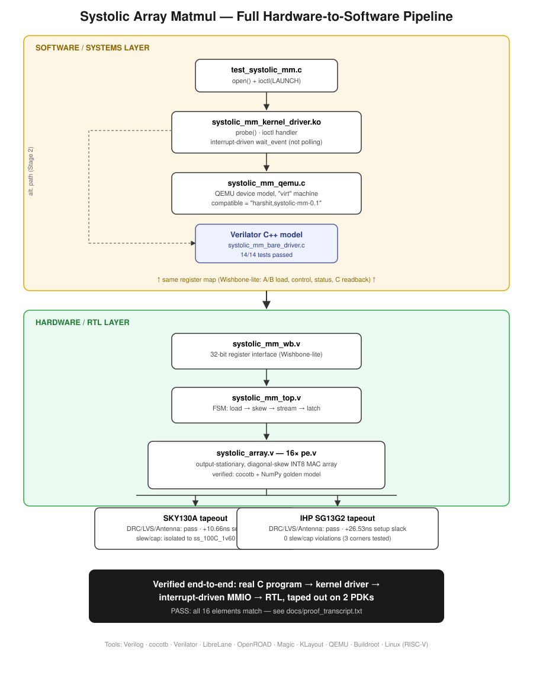

# Systolic Array Matrix Multiplier — ASIC Tapeout + Software Integration (SKY130 + IHP SG13G2)

## Overview
A parameterizable N×N (default 4×4) output-stationary systolic array performing
INT8×INT8 → INT32 matrix multiplication, designed in Verilog and taken through
full RTL-to-GDSII across two open-source 130nm PDKs (SkyWater SKY130 and IHP
SG13G2) using the LibreLane flow. The core was then wrapped in a CPU-addressable
register interface and integrated end-to-end with real software: a C driver,
a QEMU device model, and a genuine Linux kernel driver — verified with a live
system call chain from a user-space program down to interrupt-driven hardware
access.

## Design
The array consists of 16 processing elements (PEs), each performing a signed
multiply-accumulate per cycle, wired in a classic diagonal-skew dataflow — the
same architectural pattern used in TPU/NPU-class AI accelerators. A control FSM
handles matrix load, skewed streaming, and result latch-out.

## Verification (RTL)
Functional correctness was verified with a cocotb testbench (Icarus Verilog)
against a NumPy golden reference across randomized signed-INT8 matrices and
edge-case overflow conditions. A signedness bug was found and fixed during this
process — an unsized unsigned literal inside a ternary expression was silently
zero-extending negative operands before multiplication, per Verilog's
context-determined sizing rules.

## Physical Implementation

|                                | SKY130A                        | IHP SG13G2                  |
|--------------------------------|---------------------------------|------------------------------|
| DRC / LVS / Antenna            | Passed                          | Passed                       |
| Clock                          | 40ns (25MHz)                    | 40ns (25MHz)                 |
| Setup slack (worst-case)       | +10.66ns                        | +26.53ns                     |
| Hold violations                | 0                                | 0                             |
| Max Cap / Max Slew violations  | Isolated to ss_100C_1v60 corner | 0 (across 3 corners tested)  |
| PVT corners characterized      | 9                                | 3                             |

Setup and hold timing close cleanly on both PDKs. SKY130 shows residual
max-transition/max-capacitance margin violations confined entirely to the
ss_100C_1v60 (slow-process, 100°C, 1.60V) corner — the deliberately worst-case
PVT extreme — consistent with the drive-strength demands of 16 parallel MAC
units; this is a documented, reportable limitation rather than a design flaw,
with a clear path to closure (custom SDC constraints or drive-strength-optimized
cell resizing). IHP's characterized corner set is narrower (3 vs. 9), so the
comparison is directionally informative rather than exactly equivalent.

## Software Integration
The bare `systolic_mm_top` core was wrapped in a **Wishbone-lite 32-bit
register interface** (`systolic_mm_wb.v`), exposing matrix load, control, and
result readback as CPU-addressable memory-mapped registers rather than wide
flat buses — the standard mechanism by which any real processor talks to a
hardware accelerator.

On top of that interface, three progressively more realistic software layers
were built and verified:

1. **C driver via Verilator** — a portable C driver (`systolic_mm_bare_driver.c`,
   zero simulator dependencies) issuing MMIO reads/writes, compiled against the
   RTL through a Verilator-generated C++ model. 14/14 test cases passed
   (known values, INT8 overflow corner, 10 randomized trials, back-to-back
   operations).
2. **QEMU device model** — a functional C emulation of the same register map
   (`systolic_mm_qemu.c`), integrated into a custom-built QEMU as a real
   memory-mapped device on the RISC-V "virt" machine, complete with its own
   device-tree node (`compatible = "harshit,systolic-mm-0.1"`) and interrupt
   line.
3. **Linux kernel driver** — a genuine character-device driver
   (`systolic_mm_kernel_driver.c`) built against a custom RISC-V Linux kernel
   (via Buildroot), implementing `probe()`/`ioctl()`/interrupt-driven wait —
   not a polling loop. Verified end-to-end: a user-space C program
   (`test_systolic_mm_userspace.c`) opens `/dev/systolic_mm`, issues an
   `ioctl()`, the driver launches the operation over MMIO, sleeps on a wait
   queue, wakes on the QEMU model's interrupt, and returns the correct result.
   Full boot-to-PASS session captured in `docs/proof_transcript.txt`.

  

This mirrors how real chip companies develop and validate drivers before
silicon exists: the kernel driver and register-level protocol are exercised
against a faithful software model of the hardware, with the RTL itself
independently verified and physically implemented in parallel.

## Scope Note
Unlike a prior SPI-controller tapeout, this project does not implement a
physical I/O padframe: the design's wide parallel buses would require 770+
package pins, which is impractical for direct off-chip integration. This is a
deliberate architectural choice — a real deployment of this block would
connect via on-chip interconnect (as demonstrated by the register interface
above), not package-level pins — documented here as a boundary of scope
rather than an omission.

## Repository Structure
- `src/`            — Verilog RTL (pe.v, systolic_array.v, systolic_mm_top.v, systolic_mm_wb.v)
- `tb/`             — cocotb testbenches (core + Wishbone bus interface)
- `sim_verilator/`  — Verilator C++ harness driving the RTL from real C code
- `sw/`             — C driver, QEMU device model, Linux kernel driver, ioctl header, userspace test
- `config.json`     — LibreLane flow configuration
- `results/`        — Final GDS and STA summary reports for SKY130 and IHP SG13G2
- `docs/`           — Register map documentation, boot-to-PASS proof transcript

## Tools Used
Verilog, cocotb, Icarus Verilog, Verilator, LibreLane, OpenROAD, Magic,
KLayout, QEMU (custom-built), Buildroot, Linux kernel (RISC-V), GCC
cross-toolchain
